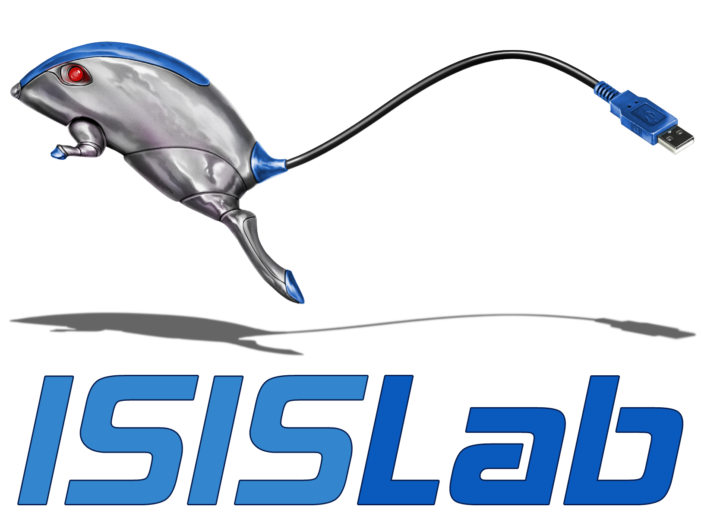
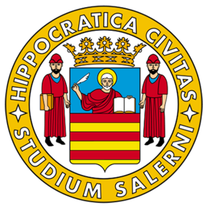

<p align="center">
  <a href="https://www.isislab.it/">
    
  </a>
  &nbsp;&nbsp;&nbsp;
  <a href="https://www.unisa.it/">
    
  </a>
  &nbsp;&nbsp;&nbsp;
  <a href="https://www.di.unisa.it/en">
    
  </a>
</p>

<h1 align="center">🎓 ISISLab · UNISA LaTeX Templates</h1>

<p align="center">
  <strong>Official presentation and thesis templates for ISISLab students and researchers.</strong>
</p>

<p align="center">
  <a href="https://github.com/isislab-unisa/template/blob/main/LICENSE">
    
  </a>
  <a href="https://github.com/isislab-unisa/template/commits/main">
    
  </a>
  
  
  
  
</p>

<p align="center">
  <a href="./slides"><strong>🖥️ Slides</strong></a>
  ·
  <a href="./thesis"><strong>📘 Thesis</strong></a>
  ·
  <a href="https://github.com/isislab-unisa/template/archive/refs/heads/main.zip"><strong>⬇️ Download ZIP</strong></a>
</p>

---

## ✨ About

This repository provides two ready-to-use LaTeX templates for the
[ISISLab](https://www.isislab.it/) community at the
[Department of Computer Science](https://www.di.unisa.it/en),
[University of Salerno](https://www.unisa.it/).

| Template | Best for | Main features |
|:--|:--|:--|
| **[Slides](./slides)** | Thesis defenses, seminars and research talks | Beamer, 16:9 layout, English/Italian labels, reusable visual components |
| **[Thesis](./thesis)** | Bachelor and Master theses | English/Italian content, configurable metadata, appendix, writing guide and reproducibility checklist |

> [!TIP]
> Use **Overleaf** for the easiest setup. No custom compiler command or shell escape is required.

---

## 🚀 Quick start

### Clone the repository

```bash
git clone https://github.com/isislab-unisa/template.git
cd template
```

### Use Overleaf

1. Download this repository as a ZIP.
2. Choose either the `slides` or `thesis` folder.
3. Create a ZIP containing that folder's files.
4. In Overleaf, select **New Project → Upload Project**.
5. Keep `main.tex` as the main document.
6. Select **pdfLaTeX** and click **Recompile**.

### Compile locally

Install a recent **TeX Live** or **MiKTeX** distribution with `latexmk`.

```bash
cd slides   # or: cd thesis
latexmk -pdf main.tex
```

---

## 🖥️ Presentation template

<p align="center">
  <a href="./slides/main.pdf"><strong>📄 English demo PDF</strong></a>
  ·
  <a href="./slides/main_ita.pdf"><strong>📄 Italian demo PDF</strong></a>
  ·
  <a href="./slides/README.md"><strong>📖 Slides notes</strong></a>
</p>

The slide template is a modern Beamer theme for clear scientific storytelling.

### Build a presentation

```bash
cd slides

# English demo
latexmk -pdf main.tex

# Italian demo
latexmk -pdf main_ita.tex
```

### Edit the presentation

Open `slides/main.tex` and change:

```latex
\title{Your Presentation Title}
\subtitle{A clear and short subtitle}
\author{Your Name}
\institute{Department of Computer Science, Università degli Studi di Salerno}
\date{\today}
```

For Italian fixed labels, load the theme with:

```latex
\usepackage[italian]{isislabtheme}
```

Accepted Italian aliases are `italian`, `italiano` and `ita`.

### Reusable components

| Command | Purpose |
|:--|:--|
| `\ISISSectionIntro` | Full-screen section divider |
| `\ISISCard` | Styled content card |
| `\ISISMetricCard` | Highlight an important number |
| `\ISISBadge` | Small colored label |
| `\ISISVisualList` | Numbered visual list |
| `\ISISPipeline` | Process or method pipeline |
| `\ISISBarChart` | Lightweight bar chart |
| `\ISISLineChart` | Lightweight line chart |

The theme automatically includes ISISLab and Department branding from
`slides/assets/`.

---

## 📘 Thesis template

<p align="center">
  <a href="./thesis/main.pdf"><strong>📄 Demo PDF</strong></a>
  ·
  <a href="./thesis/README.md"><strong>📖 Full thesis notes</strong></a>
  ·
  <a href="./thesis/START-HERE.txt"><strong>⚡ Start here</strong></a>
</p>

The thesis project supports:

- 🎓 Bachelor and Master theses
- 🇬🇧 English and 🇮🇹 Italian
- 📝 Configurable student and thesis metadata
- 📚 Standard BibTeX with `ACM-Reference-Format`
- 📎 Optional technical appendix
- ✅ Optional reproducibility checklist
- ✍️ Optional bilingual research-writing guide
- 🧩 Fixed preview files for every degree/language combination

### 1. Select degree and language

Edit `thesis/configuration.tex`:

```latex
\providecommand{\ISISDegreeChoice}{bachelor}  % bachelor | master
\providecommand{\ISISLanguageChoice}{italian} % english  | italian
```

### 2. Select optional content

```latex
\providecommand{\ISISResearchWritingGuideChoice}{disabled}
\providecommand{\ISISAppendixChoice}{enabled}
\providecommand{\ISISReproducibilityChecklistChoice}{enabled}
```

> [!IMPORTANT]
> The research-writing guide is teaching material. Disable it before preparing the final thesis.

Available accent colors:

```latex
\thesisaccent{ISISBlue}
```

Options: `ISISBlue`, `ISISLightBlue`, `ISISDeepBlue`, `ISISCyan`, `ISISRed`.

### 3. Edit your information

Open `thesis/metadata.tex` and set:

- thesis title and subtitle;
- student name and ID;
- degree course and department;
- supervisor and co-supervisor;
- academic year and keywords;
- ISISLab name and website.

### 4. Replace the example content

| Content | Folder |
|:--|:--|
| Bachelor chapters | `thesis/content/bachelor/` |
| Master chapters | `thesis/content/master/` |
| Front matter | degree folder inside `thesis/content/` |
| Writing guide | `thesis/content/writing-guide/` |
| Appendix | `thesis/content/appendix/` |
| Reproducibility checklist | `thesis/content/reproducibility/` |

The selected language automatically loads the matching English or Italian files.

### 5. Add references

Add BibTeX entries to `thesis/references.bib` and cite them normally:

```latex
\cite{yourReferenceKey}
```

### Fixed build variants

You can also compile a specific configuration directly:

```bash
latexmk -pdf variant-bachelor-english.tex
latexmk -pdf variant-bachelor-italian.tex
latexmk -pdf variant-master-english.tex
latexmk -pdf variant-master-italian.tex
```

---

## 🗂️ Repository structure

```text
template/
├── slides/
│   ├── assets/
│   ├── isislabtheme.sty
│   ├── main.tex
│   ├── main_ita.tex
│   └── README.md
├── thesis/
│   ├── assets/
│   ├── content/
│   ├── configuration.tex
│   ├── metadata.tex
│   ├── isislab-thesis.sty
│   ├── references.bib
│   ├── variant-*.tex
│   └── main.tex
├── LICENSE
└── README.md
```

---

## ✅ Before submission

Please verify the current rules of your degree programme, including:

- official cover wording;
- degree-course and department names;
- supervisor roles;
- declarations;
- required thesis structure and formatting.

University rules always take priority over this template.

---

## 🤝 Contributing

Improvements, bug reports and documentation fixes are welcome.

1. Fork the repository.
2. Create a branch.
3. Make and test your changes.
4. Open a pull request with a clear description.

For problems or suggestions, [open an issue](https://github.com/isislab-unisa/template/issues).

---

## ⚖️ License and branding

The source code is released under the [MIT License](./LICENSE).

University, Department and ISISLab names and logos remain the property of their
respective owners. Use them only for appropriate academic and institutional
purposes.

---

<p align="center">
  Made with ❤️ for the ISISLab and UNISA student community.
</p>